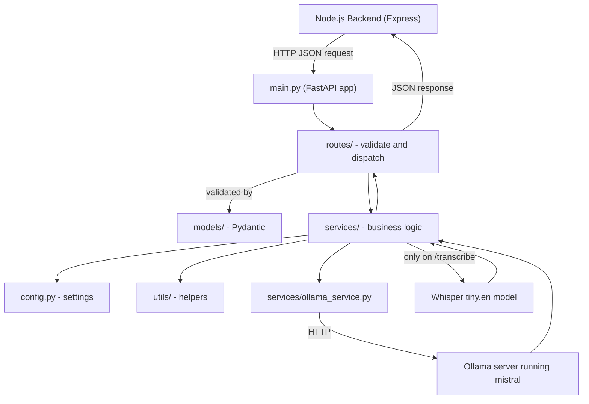
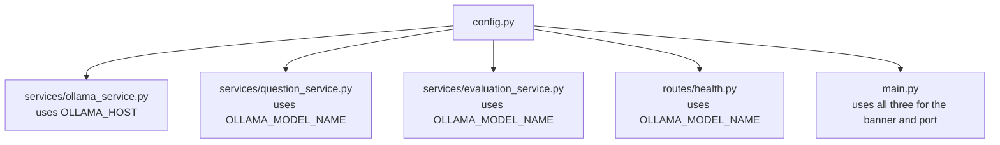
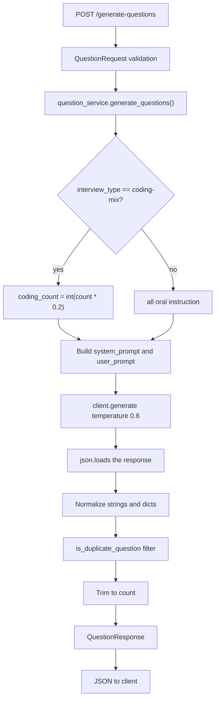
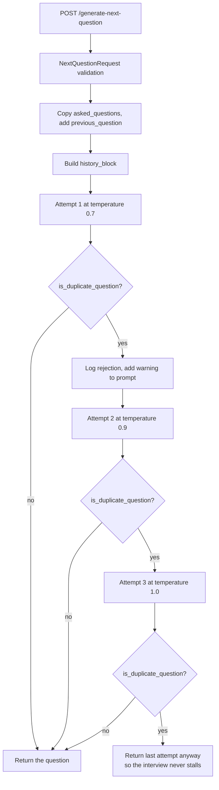
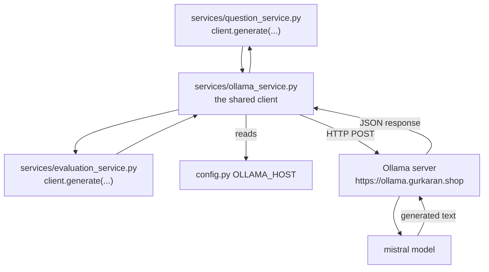
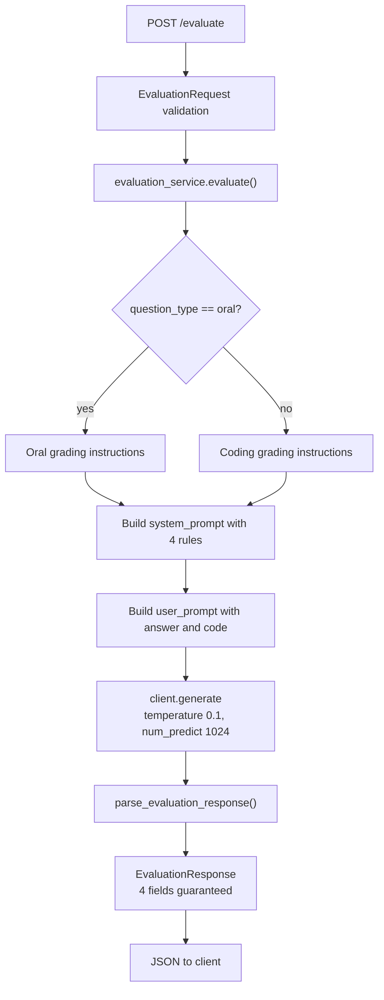
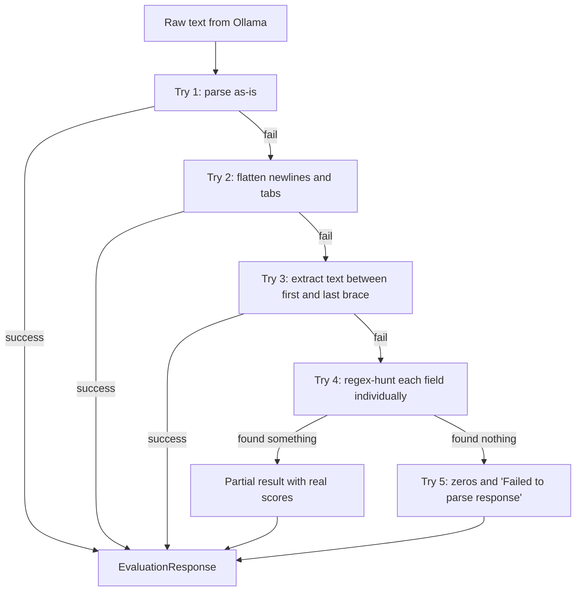
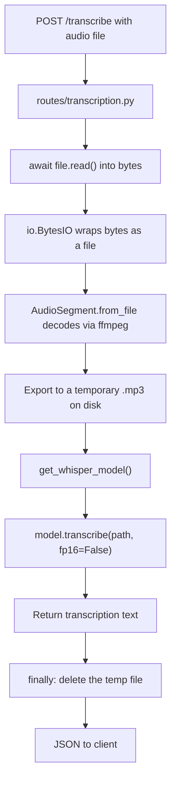
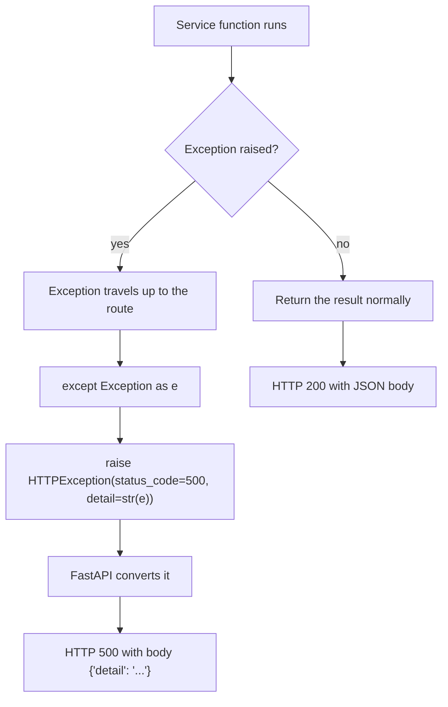
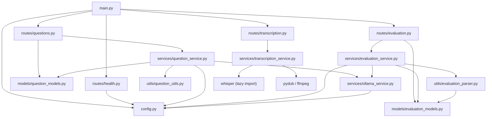

# AI Interviewer – AI Service Architecture Guide

This guide explains the AI microservice **exactly as the code exists today**. Every code block below is copied from a real file in this folder. Nothing here is invented or generic FastAPI advice.

---

## What this service does

This is a small Python web server (FastAPI) that does four AI jobs for the AI Interviewer app:

1. **Generates interview questions** for a role and experience level.
2. **Generates the next follow-up question** based on how the candidate answered.
3. **Transcribes the candidate's recorded audio** into text (speech to text).
4. **Evaluates the candidate's answer** and returns scores plus an ideal answer.

It talks to two AI engines:

- **Ollama** – a server running the `mistral` language model. Used for questions and evaluation.
- **Whisper** – OpenAI's speech-to-text model, running locally inside this service. Used for transcription.

This service does **not** have a database, does **not** have login/authentication, and does **not** know anything about users or sessions. It is a pure "give me input, I return AI output" service.

---


## Why the code was refactored

Originally **all** of this lived in one file: `main.py`, 438 lines long. That single file held the config, the AI client, the data models, the duplicate detection algorithm, the JSON repair logic, the Whisper loader, all the AI prompts, and all five API endpoints.

That works, but it creates real problems:


| Problem with one big file | What it feels like                                                                                                            |
| ------------------------- | ----------------------------------------------------------------------------------------------------------------------------- |
| Hard to find things       | "Where is the scoring prompt?" means scrolling through 438 lines.                                                             |
| Scary to change           | Editing the evaluation prompt means opening the same file that holds transcription. One typo can break an unrelated endpoint. |
| Hard to reuse             | The duplicate-detection function was buried between two endpoints, so it did not feel reusable.                               |
| Hard to test              | To test one small helper you had to import the whole app, which creates the Ollama client and builds the FastAPI server.      |
| Merge conflicts           | Two people editing two different features touch the same file.                                                                |


### Old vs new

**Old approach — one file, everything mixed:**

```
main.py  (438 lines)
├── config values
├── ollama client
├── whisper loader
├── 5 pydantic models
├── duplicate detection
├── JSON parser
├── AI prompts
└── 5 API endpoints
```

**New approach — each file has one job:**

```
main.py  (35 lines)   <- only starts the app
config.py             <- only settings
models/               <- only data shapes
routes/               <- only URLs
services/             <- only business logic
utils/                <- only reusable helpers
```

The important idea: **nothing was rewritten**. The prompts, the numbers, the algorithm, and the API responses are byte-for-byte the same. Only the *location* of the code changed.

---


## SECTION 1 — Complete folder structure

```
ai-service/
│
├── main.py                          # Creates the app, adds CORS, registers routes, starts the server
├── config.py                        # Reads environment variables (.env) into Python variables
├── requirements.txt                 # Python packages this service needs
├── Dockerfile                       # How to build this service as a container
├── runtime.txt                      # Python version for deployment
├── .env                             # Local secrets/settings (NOT committed to git)
│
├── models/                          # "What shape is the data?"
│   ├── __init__.py
│   ├── question_models.py           # QuestionRequest, NextQuestionRequest, QuestionResponse
│   └── evaluation_models.py         # EvaluationRequest, EvaluationResponse
│
├── routes/                          # "What URLs exist?"
│   ├── __init__.py
│   ├── health.py                    # GET  /
│   ├── questions.py                 # POST /generate-questions, POST /generate-next-question
│   ├── evaluation.py                # POST /evaluate
│   └── transcription.py             # POST /transcribe
│
├── services/                        # "What actually happens?"
│   ├── __init__.py
│   ├── ollama_service.py            # The one shared Ollama client
│   ├── question_service.py          # Question generation logic + prompts
│   ├── evaluation_service.py        # Scoring logic + prompts
│   └── transcription_service.py     # Whisper loading + audio conversion
│
└── utils/                           # "Small reusable tools"
    ├── __init__.py
    ├── question_utils.py            # Duplicate question detection
    └── evaluation_parser.py         # Repairs broken JSON from the AI
```


### Why each folder exists

`models/` **— the shape of the data.**
Pydantic models describe what fields a request must have and what types they are. FastAPI uses them to automatically validate incoming JSON and reject bad requests with a `422` error before your code ever runs. They belong in their own folder because they are **pure data definitions** — they contain no logic, call nothing, and can be safely imported by anyone without side effects.

`routes/` **— the doorway.**
A route's only job is: receive an HTTP request, hand it to a service, and turn the answer (or an error) into an HTTP response. Routes are deliberately **thin**. If you look at `routes/evaluation.py`, the entire file is 15 lines. Keeping routes thin means the HTTP layer and the AI logic can change independently.

`services/` **— the brain.**
This is where the real work happens: building AI prompts, calling Ollama, loading Whisper, converting audio. Services know nothing about HTTP — no URLs, no status codes. That means you could call `question_service.generate_questions(...)` from a script, a test, or a background job without a web server running.

`utils/` **— the toolbox.**
Small, self-contained helper functions that don't belong to any single feature. `is_duplicate_question()` is used by **both** question-generation functions, so it lives here instead of being copy-pasted. Utils never call services, which keeps the dependency direction clean.

`config.py` **— the single source of settings.**
Every environment variable is read in exactly one place. If settings were scattered, changing the Ollama address would mean hunting through many files.

### What are the `__init__.py` files?

They are **empty files**. Their only purpose is to tell Python "this folder is a package you can import from." Without `models/__init__.py`, the line `from models.question_models import QuestionRequest` would fail with `ModuleNotFoundError`.

---


## SECTION 2 — High level application flow




### The flow in plain steps

1. The Node.js backend sends an HTTP request (for example `POST /evaluate`) to this service.
2. FastAPI, created in `main.py`, receives it.
3. FastAPI looks at the URL and finds the matching function inside `routes/`.
4. Before your code runs, FastAPI validates the JSON body against the Pydantic model from `models/`. If a required field is missing, it stops here and returns `422`.
5. The route function calls the matching service function, e.g. `evaluation_service.evaluate(request)`.
6. The service builds an AI prompt and calls Ollama through the shared client, or loads Whisper for audio.
7. The AI returns raw text. A util function cleans it up (`parse_evaluation_response`) or filters it (`is_duplicate_question`).
8. The service returns a Python object (a Pydantic model or a plain dict) to the route.
9. The route returns it. FastAPI converts it to JSON and sends it back.
10. If **anything** raised an error in steps 6–8, the route catches it and returns HTTP `500` with the error message.

---


## SECTION 3 — Application startup flow

When you run `python main.py`, here is the exact order of events.

**Step 1 — Python reads** `main.py` **top to bottom.** It starts with the imports:

```python
import uvicorn  # Similar to node + express
from fastapi import FastAPI
from fastapi.middleware.cors import CORSMiddleware

from config import AI_SERVICE_PORT, OLLAMA_HOST, OLLAMA_MODEL_NAME
from routes import evaluation, health, questions, transcription
```

**Step 2 —** `from config import ...` **runs** `config.py` **completely.** That file calls `load_dotenv()`, which finds the `.env` file and loads its contents into the environment. Then the three settings variables are created.

**Step 3 —** `from routes import ...` **triggers a chain reaction.** Importing `routes/questions.py` causes it to import `services/question_service.py`, which imports `services/ollama_service.py`, which runs:

```python
client = ollama.Client(host=OLLAMA_HOST)
```

This creates the Ollama client object. **It does not connect to anything yet** — it just stores the address for later use.

**Step 4 — The startup banner prints.**

```python
print("=" * 60)
print("AI Microservice Starting...")
print(f"AI_SERVICE_PORT : {AI_SERVICE_PORT}")
...
```

This is why you see the banner in the Render logs. It confirms which host and model the service will use, which is very handy when debugging a bad `.env`.

**Step 5 — The FastAPI app is created**, CORS is added, and the four routers are registered.

**Step 6 — Uvicorn starts the web server** and begins listening for requests.

### What does NOT happen at startup

This part matters a lot for a free hosting plan:

- **Ollama is not contacted.** No question is generated, no model is loaded on the Ollama side. The client object is just an address holder. The first real network call happens when a request arrives.
- **Whisper is NOT loaded.** Look carefully at `services/transcription_service.py`:

```python
WHISPER_MODEL = None


def get_whisper_model():
    """Load Whisper only when transcription is requested (keeps Render startup under RAM limit)."""
    global WHISPER_MODEL
    if WHISPER_MODEL is None:
        import whisper  # lazy: importing whisper pulls in torch
```

The line `import whisper` is written **inside the function**, not at the top of the file. That is intentional.

### Why lazy Whisper loading matters

The `whisper` package depends on **PyTorch**, which is a very heavy library. Simply importing it consumes a large amount of RAM before you have transcribed a single second of audio. Loading the model itself uses even more.

Free hosting plans (like Render's free tier) give you a small, fixed amount of RAM. If the service tried to load Whisper at startup, the process would be killed by the platform for using too much memory — the service would crash-loop and never come online.

By moving `import whisper` inside `get_whisper_model()`, the memory cost is only paid the first time somebody actually posts audio to `/transcribe`. The service boots quickly, uses little memory, and stays alive.

---


## SECTION 4 — `main.py` explained

The whole file is 35 lines. Here it is, piece by piece.

### The imports

```python
import uvicorn  # Similar to node + express
from fastapi import FastAPI
from fastapi.middleware.cors import CORSMiddleware

from config import AI_SERVICE_PORT, OLLAMA_HOST, OLLAMA_MODEL_NAME
from routes import evaluation, health, questions, transcription
```

- `uvicorn` is the actual web server that runs FastAPI. FastAPI defines *what* to do; uvicorn handles the networking.
- `FastAPI` is the application class.
- `CORSMiddleware` lets browsers from other domains call this service.
- The `config` import gives us the settings.
- The `routes` import brings in the four route modules. **This line is what makes the endpoints exist.**

**If the** `routes` **import were removed:** the app would start fine but every URL would return `404 Not Found`, because no routes would be registered.

### Creating the app

```python
app=FastAPI(title="AI Interviewer Microservice",version="1.0")
```

- `app` is the object that holds every route and setting. The name `app` matters: the deploy command is `uvicorn main:app`, which literally means "in the file `main`, find the variable named `app`".
- `title` and `version` are documentation labels. Visit `/docs` and you will see them at the top of the auto-generated API page.

**If** `title` **and** `version` **were removed:** nothing would break functionally; the docs page would just show default text.

### CORS middleware

```python
origins = ["*"]
app.add_middleware(
    CORSMiddleware,
    allow_origins=origins,
    allow_credentials=True,
    allow_methods=["*"],
    allow_headers=["*"],
)
```

"Middleware" means code that runs on **every** request, before and after your route.

Browsers enforce a security rule called the *same-origin policy*: a page loaded from `site-a.com` cannot call `site-b.com` unless `site-b` explicitly allows it. CORS headers are that permission slip.

- `allow_origins=["*"]` — allow requests from any domain.
- `allow_credentials=True` — allow cookies and auth headers to be sent.
- `allow_methods=["*"]` — allow `GET`, `POST`, `OPTIONS`, and all others.
- `allow_headers=["*"]` — allow any custom header, such as `Content-Type: application/json`.

**If this block were removed:** server-to-server calls from the Node backend would still work perfectly (CORS is a *browser* rule, not a server rule), but calling this service directly from browser JavaScript would fail.

> Note: `allow_origins=["*"]` combined with `allow_credentials=True` is permissive. It is acceptable here because this service holds no user data and no login, but on a public service you would normally list specific domains.


### Registering the routers

```python
app.include_router(health.router)
app.include_router(questions.router)
app.include_router(transcription.router)
app.include_router(evaluation.router)
```

Each route file creates its own mini-app called an `APIRouter`. `include_router()` copies its endpoints into the main `app`.

After these four lines the app knows about exactly five URLs:


| From                   | URL                                                        |
| ---------------------- | ---------------------------------------------------------- |
| `health.router`        | `GET /`                                                    |
| `questions.router`     | `POST /generate-questions`, `POST /generate-next-question` |
| `transcription.router` | `POST /transcribe`                                         |
| `evaluation.router`    | `POST /evaluate`                                           |


**If one line were removed:** only that file's endpoints would disappear and return `404`. The rest would keep working.

### The startup block

```python
if __name__ == "__main__":
    uvicorn.run(app,host="0.0.0.0",port=AI_SERVICE_PORT)
```

`__name__` is a built-in Python variable. It equals `"__main__"` **only** when the file is run directly (`python main.py`). If the file is *imported* by something else, `__name__` becomes `"main"` instead, and this block is skipped.

Why does that matter? Because in production the start command is `uvicorn main:app --host 0.0.0.0 --port $PORT`. That **imports** `main.py` rather than running it, so this block does not execute — uvicorn is already handling the server. Without the `if` guard, you would risk trying to start a second server inside the first one.

- `host="0.0.0.0"` means "accept connections from any network interface", not just from this computer. Inside a container this is required, otherwise the outside world cannot reach it.
- `port=AI_SERVICE_PORT` comes from config, defaulting to `8000`.

---


## SECTION 5 — `config.py` explained

The entire file:

```python
import os

from dotenv import load_dotenv

load_dotenv()

AI_SERVICE_PORT = int(os.getenv("AI_SERVICE_PORT", 8000))
OLLAMA_MODEL_NAME = os.getenv("OLLAMA_MODEL_NAME", "mistral")
OLLAMA_HOST = os.getenv("OLLAMA_HOST", "http://localhost:11434")
```


### `load_dotenv()`

This looks for a file named `.env` and loads every `KEY=value` line inside it into the environment, as if you had typed them into your terminal.

A `.env` file for this project looks roughly like:

```
OLLAMA_HOST=https://ollama.gurkaran.shop
OLLAMA_MODEL_NAME=mistral
```

`.env` is **not committed to git** because it can contain private addresses and keys. On Render there is no `.env` file at all — you set the same variables in the dashboard, and `os.getenv` reads them from the real environment. `load_dotenv()` simply finds nothing and does no harm.

**Important:** `load_dotenv()` must run *before* the `os.getenv` lines, which is why it sits on line 5. If it ran after, the variables would not be loaded yet and every setting would silently fall back to its default.

### `os.getenv("VAR")` vs `os.getenv("VAR", "default")`

```python
os.getenv("OLLAMA_HOST")                            # returns None if not set
os.getenv("OLLAMA_HOST", "http://localhost:11434")  # returns the default if not set
```

The one-argument version returns `None` when the variable is missing, which usually causes a confusing crash much later. The two-argument version supplies a sensible fallback. This project uses defaults everywhere so it runs on a fresh laptop with zero configuration: Ollama defaults to `localhost:11434`, which is where Ollama runs when installed locally.

### The three settings


| Variable            | Default                    | Meaning                                                                                                                                   |
| ------------------- | -------------------------- | ----------------------------------------------------------------------------------------------------------------------------------------- |
| `AI_SERVICE_PORT`   | `8000`                     | Which port to listen on. Wrapped in `int()` because environment variables are always strings, and `uvicorn.run(port=...)` needs a number. |
| `OLLAMA_MODEL_NAME` | `"mistral"`                | Which language model to ask. Changing this to another installed model switches the AI everywhere at once.                                 |
| `OLLAMA_HOST`       | `"http://localhost:11434"` | The address of the Ollama server.                                                                                                         |


### Who uses these values




### Why configuration should live in one place

Imagine `OLLAMA_HOST` were read separately inside `question_service.py`, `evaluation_service.py`, and `main.py`. To change the Ollama address you would have to find and edit all three, and if you missed one you would get a bug where questions work but evaluation silently talks to the wrong server. With a single `config.py`, there is exactly one place to look and one place to change.

---


## SECTION 6 — Models explained

Pydantic models are **classes that describe data**. FastAPI reads them and does three things automatically: validates incoming JSON, converts types, and generates API documentation.

### `models/question_models.py`

```python
class QuestionRequest(BaseModel):
    role:str="MERN Stack Developer"
    level:str="Junior"
    count:int=5
    interview_type:str="coding-mix"
```


| Field            | Type  | Default                  | Meaning                                                        |
| ---------------- | ----- | ------------------------ | -------------------------------------------------------------- |
| `role`           | `str` | `"MERN Stack Developer"` | The job role to interview for.                                 |
| `level`          | `str` | `"Junior"`               | Experience level: Junior, Mid-Level, Senior.                   |
| `count`          | `int` | `5`                      | How many questions to generate.                                |
| `interview_type` | `str` | `"coding-mix"`           | Either `"coding-mix"` or anything else (treated as oral-only). |


Because **every field has a default**, you can post an empty body `{}` and it still works. The Node backend always sends `count: 1`, overriding the default.

```python
# Alias for the original misspelled name, kept so older imports keep resolving.
QuestionResquest = QuestionRequest
```

**Why this alias exists.** In the original `main.py`, the class was misspelled `QuestionResquest` ("Resquest" instead of "Request"). During the refactor the name was corrected to `QuestionRequest`, but this line keeps the old spelling working as a second name for the exact same class. Any code that still does `from models.question_models import QuestionResquest` will not break.

This is a common technique called a **backward-compatibility alias**. It costs one line and removes all risk from a rename. It does not create a second class — `QuestionResquest is QuestionRequest` is `True`; they are literally the same object with two names.

```python
class NextQuestionRequest(BaseModel):
    role:str
    level:str
    interview_type:str
    previous_question:str
    user_answer:Optional[str]=None
    user_code:Optional[str]=None
    ai_feedback:str
    asked_questions:Optional[list[str]]=None
```

Notice the difference: `role`, `level`, `interview_type`, `previous_question`, and `ai_feedback` have **no default**, which makes them **required**. If the backend forgets one, FastAPI rejects the request with `422` before the service runs.

`Optional[str] = None` means "this may be a string, or it may be missing entirely." That is correct here because a candidate might answer with only speech (no code) or only code (no speech).

`Optional[list[str]] = None` on `asked_questions` is the list of every question already asked in this interview. It is optional so that older backend versions that don't send it still work.

```python
class QuestionResponse(BaseModel):
    questions:list[str]
    model_used:str
```

This is a **response** model, describing what we send *back*. `questions` is a list of plain strings; `model_used` tells the caller which AI model produced them (useful for debugging).

### `models/evaluation_models.py`

```python
class EvaluationRequest(BaseModel):
    question:str
    question_type:str
    role:str
    level:str
    user_answer:Optional[str]=None
    user_code:Optional[str]=None


class EvaluationResponse(BaseModel):
    technicalScore:int
    confidenceScore:int
    aiFeedback:str
    idealAnswer:str
```

`question_type` is the important one: it is either `"oral"` or something else (treated as coding), and it decides which scoring instructions the AI receives.

The four response fields use **camelCase** rather than Python's usual snake_case. That is deliberate — these values are stored directly in MongoDB and rendered by the React frontend, both of which are JavaScript, where camelCase is the convention. Renaming them would break the frontend.

### Request/response flow per endpoint

`POST /generate-questions`

```
Request  -> QuestionRequest   { role, level, count, interview_type }
Response -> QuestionResponse  { questions: [...], model_used: "mistral" }
```

`POST /generate-next-question`

```
Request  -> NextQuestionRequest { role, level, interview_type, previous_question,
                                  user_answer?, user_code?, ai_feedback, asked_questions? }
Response -> plain dict          { question: "...", questionType: "oral" }
```

Note this endpoint has **no** response model. `routes/questions.py` declares it as `@router.post("/generate-next-question")` with no `response_model=`, so FastAPI returns the dictionary as-is without validation.

`POST /evaluate`

```
Request  -> EvaluationRequest  { question, question_type, role, level, user_answer?, user_code? }
Response -> EvaluationResponse { technicalScore, confidenceScore, aiFeedback, idealAnswer }
```

---


## SECTION 7 — Routes explained

A route file answers one question: **which URLs exist, and who handles them?**

Every route in this project follows the same three-line shape:

1. `try:` call the service
2. `except Exception as e:` catch anything that went wrong
3. `raise HTTPException(status_code=500, detail=str(e))`


### `routes/health.py`

```python
router = APIRouter()


@router.get("/")
async def root():
    return {"message":"Hello from AI Interviewer Microservice !","model":OLLAMA_MODEL_NAME}
```

- **Method:** `GET`  ·  **URL:** `/`  ·  **Body:** none
- **Service called:** none — it answers directly.
- **Returns:** `{"message": "Hello from AI Interviewer Microservice !", "model": "mistral"}`

This is a **health check**. Hosting platforms ping it to confirm the service is alive, and you can open it in a browser to confirm a deploy succeeded. Including the model name means one glance tells you the config loaded correctly.

It has no `try/except` because there is nothing that can fail — it just builds a dictionary.

### `routes/questions.py`

```python
@router.post("/generate-questions", response_model=QuestionResponse)
async def generate_questions(request: QuestionRequest):
    try:
        return question_service.generate_questions(request)
    except Exception as e:
        raise HTTPException(status_code=500, detail=str(e))
```

- **Method:** `POST`  ·  **URL:** `/generate-questions`
- **Validated by:** `QuestionRequest`. The type hint `request: QuestionRequest` is what tells FastAPI to parse and validate the JSON body.
- **Service called:** `question_service.generate_questions(request)`
- **Returns:** a `QuestionResponse` object. `response_model=QuestionResponse` makes FastAPI double-check the outgoing shape too.

```python
@router.post("/generate-next-question")
async def generate_next_question(request: NextQuestionRequest):
    try:
        return question_service.generate_next_question(request)
    except Exception as e:
        raise HTTPException(status_code=500, detail=str(e))
```

- **Validated by:** `NextQuestionRequest`
- **Service called:** `question_service.generate_next_question(request)`
- **Returns:** a plain dict `{"question": ..., "questionType": ...}`

Flow:

```
Client
  ↓
routes/questions.py
  ↓
QuestionRequest validates the body
  ↓
services/question_service.py -> generate_questions()
  ↓
services/ollama_service.py -> client.generate()
  ↓
utils/question_utils.py -> is_duplicate_question()
  ↓
QuestionResponse
  ↓
Client
```


### `routes/evaluation.py`

```python
@router.post("/evaluate", response_model=EvaluationResponse)
async def evaluate(request: EvaluationRequest):
    try:
        return evaluation_service.evaluate(request)
    except Exception as e:
        print(f"Failed to generate response: {e}")
        raise HTTPException(status_code=500, detail=str(e))
```

This is the **only route with extra logging**. The `print(f"Failed to generate response: {e}")` line writes the error to the server logs before returning it. It exists because evaluation is the most failure-prone endpoint: it depends on Ollama producing valid JSON, and when Render's Ollama call fails, you want the reason visible in the log rather than only in an HTTP response the user never sees.

### `routes/transcription.py`

```python
@router.post("/transcribe")
async def transcribe_audio(file: UploadFile = File(...)):
    try:
        return await transcription_service.transcribe_audio(file)
    except Exception as e:
        raise HTTPException(status_code=500, detail=str(e))
```

This route takes an **uploaded file**, not JSON. Note the `await` — the service function is `async` because reading an uploaded file is an I/O operation.

Flow:

```
Client (multipart/form-data with audio)
  ↓
routes/transcription.py
  ↓
services/transcription_service.py -> transcribe_audio()
  ↓
pydub converts audio to MP3
  ↓
get_whisper_model() loads Whisper (first call only)
  ↓
{"transcription": "..."}
  ↓
Client
```

---


## SECTION 8 — Question generation flow (`POST /generate-questions`)

Let us walk through `question_service.generate_questions()` line by line.

### 1. Logging the request

```python
print("\n========== GENERATE QUESTIONS ==========")
print(f"Role           : {request.role}")
print(f"Level          : {request.level}")
print(f"Interview Type : {request.interview_type}")
print(f"Count          : {request.count}")
```

These appear in the Render logs. When something goes wrong, this tells you exactly what was asked for.

### 2. Deciding the question mix

```python
if request.interview_type == "coding-mix":
    coding_count = int(request.count * 0.2)
    oral_count = int(request.count) - int(coding_count)

    intruction = (
        f"The first {coding_count} questions MUST be coding challenge requiring function implementation. "
        f"The remaining {oral_count} questions MUST be conceptual oral questions."
    )
else:
    intruction = (
        "All questions MUST be conceptual oral questions. "
        "Do Not generate any coding or implementation challenges."
    )
```

`int(count * 0.2)` means "20% of the questions should be coding challenges", rounded **down**.


| `count` | `count * 0.2` | `coding_count` | `oral_count` |
| ------- | ------------- | -------------- | ------------ |
| 1       | 0.2           | **0**          | 1            |
| 5       | 1.0           | 1              | 4            |
| 10      | 2.0           | 2              | 8            |


> **Worth knowing:** the Node backend always sends `count: 1`, so `coding_count` is always `0` in practice and the prompt asks for "the first 0 questions MUST be coding". The 20% rule effectively never triggers with the current backend. This is existing behavior, preserved exactly as it was.


### 3. Building the prompts

```python
system_prompt = (
    "You are an expert technical interviewer. "
    "Task: Generate interview questions. "
    "CRITICAL: Do NOT include any introductory phrases like 'To help you understand...' or 'Here is a question:'. "
    "CRITICAL: Start immediately with the question body. "
    f"Instructions: {intruction} "
    "Respond ONLY with a JSON object containing a 'questions' array of strings."
)

user_prompt = (
    f"Generate exactly {request.count} unique, comprehensive interview questions for a {request.level} level {request.role}. "
    "Preserve all necessary code context or scenario details within the single question string."
)
```

A **system prompt** sets the AI's role and rules; a **user prompt** is the actual request. The "CRITICAL" wording exists because language models love to add chatty introductions like "Sure! Here's a great question:" — which would end up displayed to the candidate.

### 4. Calling Ollama

```python
response = client.generate(
    model=OLLAMA_MODEL_NAME,
    prompt=user_prompt,
    system=system_prompt,
    format="json",
    options={"temperature":0.6},
    )
```

- `format="json"` asks Ollama to constrain its output to valid JSON.
- `temperature=0.6` controls randomness. `0.0` is fully predictable, `1.0` is very creative. `0.6` gives varied questions without going off-topic.


### 5. Parsing the response

```python
response_data = json.loads(response['response'].strip())
questions = response_data.get('questions', [])
```

Ollama returns a dict whose `'response'` key holds the model's text. `.strip()` removes stray whitespace, `json.loads` turns text into a Python dict, and `.get('questions', [])` safely reads the list (returning `[]` if the key is missing rather than crashing).

### 6. Normalizing the shape

```python
normalized_questions = []

for q in questions:
    if isinstance(q, str):
        normalized_questions.append(q)

    elif isinstance(q, dict):
        # handle {"question": "..."}
        if "question" in q:
            normalized_questions.append(q["question"])

        # fallback if single string
if isinstance(questions, str):
    normalized_questions = [questions]
```

Even with `format="json"`, the model does not always return the same structure. It might return:

- `["Question one?", "Question two?"]` — plain strings, the expected case.
- `[{"question": "Question one?"}, ...]` — objects instead of strings.
- `"Just one question?"` — a single string instead of a list.

This block handles all three. The final `if isinstance(questions, str)` **replaces** the whole list, which is important: if `questions` were a string, the `for` loop above would have iterated over its individual *characters*. That reassignment repairs it.

### 7. Removing duplicates

```python
unique_questions = []
for q in normalized_questions:
    if is_duplicate_question(q, unique_questions):
        print(f"Duplicate question dropped from batch: {q}")
        continue
    unique_questions.append(q)
```

Each question is compared against the ones already accepted. Duplicates are logged and skipped. **Why this exists:** language models frequently produce the same question twice with slightly different wording. Asking a candidate the same thing twice looks broken and wastes interview time.

### 8. Returning the result

```python
return QuestionResponse(
    questions=unique_questions[:request.count],
    model_used=OLLAMA_MODEL_NAME
)
```

`[:request.count]` trims the list, because models often ignore "generate exactly N" and return more.

### Diagram




---


## SECTION 9 — Next question generation flow (`POST /generate-next-question`)

This endpoint powers the **adaptive** part of the interview: each new question depends on how the last answer went.

### 1. Building the history list

```python
asked_questions = list(request.asked_questions or [])
if request.previous_question and request.previous_question not in asked_questions:
    asked_questions.append(request.previous_question)
```

- `request.asked_questions or []` handles the case where the field is `None`.
- `list(...)` makes a **copy**, so we never modify the incoming request object.
- `previous_question` is appended **only if it is not already there**, avoiding a pointless duplicate entry.

**Why include** `previous_question` **at all?** Because it is the question the candidate just answered, so it absolutely must not be asked again. The guard exists because the backend usually already includes it inside `asked_questions`.

### 2. Formatting history for the prompt

```python
history_block = "\n".join(f"- {q}" for q in asked_questions) or "- (none)"
```

Turns the list into a readable bullet list for the AI:

```
- Implement findLongestWord(arr).
- Explain the difference between var, let and const.
```

The `or "- (none)"` handles the very first follow-up, when no history exists yet. Without it, an empty string would produce a confusing prompt.

### 3. The prompts

```python
base_system_prompt=(
    "You are a professional technical interviewer. "
    "Task: Generate ONE follow-up interview question based on the candidate's last answer. "
    "If the answer was poor, move to a DIFFERENT and simpler topic. If it was good, challenge them with something advanced. "
    "CRITICAL: The new question MUST cover a topic that has NOT been asked before. "
    "Never rephrase, re-ask, or slightly reword an earlier question. "
    ...
)
```

```python
base_user_prompt=(
    f"Role: {request.role}\nLevel: {request.level}\n"
    f"Questions already asked (do NOT repeat these topics):\n{history_block}\n\n"
    f"Previous Question: {request.previous_question}\n"
    f"Candidate's Answer: {request.user_answer or 'None'}\n"
    f"Candidate's Code: {request.user_code or 'None'}\n"
    f"Evaluation: {request.ai_feedback}\n"
    "Ask the next question now, on a new topic."
)
```

The AI receives the full picture: the role, the whole history, the last question, what the candidate said and wrote, and the AI's own evaluation of that answer. `or 'None'` prevents the literal text "None" problem when a field is empty.

### 4. The retry loop

```python
last_result = {"question": "", "questionType": "oral"}

for attempt, temperature in enumerate((0.7, 0.9, 1.0)):
    user_prompt = base_user_prompt
    if attempt > 0:
        user_prompt += (
            f"\n\nYour previous attempt repeated an earlier question: '{last_result['question']}'. "
            f"Choose a COMPLETELY DIFFERENT area of {request.role} that shares no keywords with the list above."
        )

    response = client.generate(
        model=OLLAMA_MODEL_NAME,
        prompt=user_prompt,
        system=base_system_prompt,
        format="json",
        options={"temperature":temperature},
        )

    next_q_data = json.loads(response['response'].strip())
    last_result = {
        "question": next_q_data.get('question', ""),
        "questionType": next_q_data.get('questionType', 'oral'),
    }

    if not is_duplicate_question(last_result["question"], asked_questions):
        return last_result

    print(f"Duplicate follow-up rejected (attempt {attempt + 1}): {last_result['question']}")

return last_result
```

**Why three attempts?** Telling a model "do not repeat" in the prompt is a *request*, not a guarantee. Verifying the output with `is_duplicate_question()` is the enforcement. If it fails, we ask again.

**Why rising temperatures 0.7 → 0.9 → 1.0?** Temperature controls randomness. If the model produced a duplicate at `0.7`, asking again at the *same* temperature would likely produce the same duplicate. Increasing it pushes the model toward less predictable, more varied topics with each retry.

**What the retry adds to the prompt:** attempt 2 and 3 append a message naming the exact rejected question, so the model knows specifically what to avoid rather than guessing.

**What if all three attempts are duplicates?** The final `return last_result` (outside the loop) returns the last attempt anyway. This is a deliberate trade-off: a slightly repetitive question is much better than an error that would leave the interview frozen with no next question at all.

### Diagram




---


## SECTION 10 — `utils/question_utils.py` explained

This file answers one question: **"Have we basically asked this already?"**

### `QUESTION_FILLER_WORDS`

```python
QUESTION_FILLER_WORDS = {
    "a", "about", "an", "and", "any", "are", "as", "at", "be", "by", "can", "could",
    "describe", "did", "do", "does", "for", "from", "give", "how", "i", "if", "in",
    "is", "it", "its", "me", "of", "on", "one", "or", "please", "provide", "should",
    "some", "tell", "that", "the", "their", "them", "then", "there", "these", "this",
    "to", "us", "use", "used", "using", "was", "were", "what", "when", "where",
    "which", "why", "will", "with", "would", "you", "your",
}
```

**Why ignore words like** `the`**,** `is`**,** `what`**,** `how`**,** `can`**?** Because interviewers phrase everything the same way. Consider:

- "**Can you please explain what** a closure is?"
- "**Can you please explain what** a promise is?"

These two questions are about completely different topics, yet they share seven words. If we compared raw words, they would look almost identical and the second would be wrongly rejected as a duplicate.

By deleting this boilerplate, only the **meaningful** words survive: `closure` versus `promise` — clearly different. Words like `describe`, `provide`, and `tell` are included because they are interviewer verbs, not topics.

### `_stem()`

```python
def _stem(word: str) -> str:
    """Crude suffix stripping so 'define'/'defining'/'defines' collapse to one token."""
    for suffix in ("ing", "ed", "es", "s"):
        if len(word) > 4 and word.endswith(suffix):
            word = word[: -len(suffix)]
            break
    if len(word) > 4 and word.endswith("e"):
        word = word[:-1]
    return word
```

"Stemming" means reducing a word to its root so different grammatical forms match.


| Input      | Step 1 (suffix)          | Step 2 (trailing e)    | Result  |
| ---------- | ------------------------ | ---------------------- | ------- |
| `define`   | no suffix matches        | ends in `e` → strip    | `defin` |
| `defining` | `ing` stripped → `defin` | ends in `n`, no change | `defin` |
| `defines`  | `es` stripped → `defin`  | ends in `n`, no change | `defin` |
| `defined`  | `ed` stripped → `defin`  | ends in `n`, no change | `defin` |


All four become `defin`, so "how would you **define** a function" and "an example of **defining** a function" now match.

Two details:

- `break` stops after the first matching suffix, so `defines` is not stripped twice.
- `len(word) > 4` protects short words. Without it, `is` → `i` and `use` → `us`, creating nonsense matches.


### `_question_tokens()`

```python
def _question_tokens(text: str) -> set:
    words = re.findall(r"[a-z0-9]+", (text or "").lower())
    return {_stem(w) for w in words if w not in QUESTION_FILLER_WORDS}
```

Three things at once:

1. `.lower()` makes comparison case-insensitive, and `(text or "")` guards against `None`.
2. `re.findall(r"[a-z0-9]+", ...)` extracts only letters and numbers, throwing away punctuation like `?`, `,`, and backticks.
3. The set comprehension drops filler words and stems the rest.

The result is a **set**, which automatically removes repeats and makes intersection/union operations easy.

**Example:**

Input: `"Can you explain what a function in JavaScript does and how you would define one?"`
Output: `{"explain", "function", "javascript", "defin"}`

### `is_duplicate_question()`

```python
def is_duplicate_question(candidate: str, asked_questions, threshold: float = 0.6) -> bool:
    """True if candidate repeats a previously asked question's topic."""
    candidate_tokens = _question_tokens(candidate)
    if not candidate_tokens:
        return True

    for asked in asked_questions or []:
        asked_tokens = _question_tokens(asked)
        if not asked_tokens:
            continue

        overlap = len(candidate_tokens & asked_tokens)
        if overlap / len(candidate_tokens | asked_tokens) >= threshold:
            return True
        # One question fully contains the other's topic (just reworded/expanded)
        if overlap / min(len(candidate_tokens), len(asked_tokens)) >= 0.8:
            return True

    return False
```

`if not candidate_tokens: return True` — if the new question has no meaningful words (it is empty, or pure filler), treat it as a duplicate so it gets rejected. This quietly protects against the model returning an empty string.

`&` **is set intersection** — words in *both* questions.
`|` **is set union** — all distinct words across both.

#### Check 1: Jaccard similarity (`overlap / union`)

This measures overall similarity: *of all the topics mentioned, how many are shared?* Scores range from `0.0` (nothing in common) to `1.0` (identical). The threshold is `0.6`, meaning 60% overlap counts as a duplicate.

**Worked example:**

- Question A: "Can you explain what a function in JavaScript does and how you would define one?"
→ `{explain, function, javascript, defin}` (4 tokens)
- Question B: "Can you please explain what a function in JavaScript does and provide an example of defining one in JavaScript?"
→ `{explain, function, javascript, defin, exampl}` (5 tokens)

Intersection = `{explain, function, javascript, defin}` = **4**
Union = `{explain, function, javascript, defin, exampl}` = **5**
Similarity = 4 ÷ 5 = **0.8** ≥ 0.6 → **duplicate**. Correct, they ask the same thing.

Now a genuinely different question:

- Question C: "What is the difference between var, let, and const in JavaScript?"
→ `{differenc, between, var, let, const, javascript}` (6 tokens)

Against A: intersection = `{javascript}` = 1, union = 9, similarity = **0.11** → not a duplicate. Correct.

#### Check 2: containment (`overlap / min(...)`)

```python
if overlap / min(len(candidate_tokens), len(asked_tokens)) >= 0.8:
```

This divides by the size of the **smaller** question instead of the union.

**Why is this needed?** Imagine a short question whose topic is entirely inside a much longer one:

- Already asked: "Given a MERN app, explain how to implement server-side validation for form submissions using Express and body-parser, and provide an example checking email format and password length."
→ `{given, mern, app, explain, implement, server, side, validation, form, submission, expres, body, parser, exampl, check, email, format, password, length}` (**19 tokens**)
- New: "Explain server-side validation in Express."
→ `{explain, server, side, validation, expres}` (**5 tokens**)

Every one of the 5 new tokens already appears in the long question, so intersection = **5** and union = **19**.

Check 1 (Jaccard): 5 ÷ 19 = **0.26** — below the 0.6 threshold, so it would let this through, even though the short question is entirely covered by the long one.

Check 2 (containment): 5 ÷ min(5, 19) = 5 ÷ 5 = **1.0** ≥ 0.8 → **duplicate**. Caught.

In short: **check 1 catches reworded questions of similar length; check 2 catches a question that is a subset of another, regardless of length difference.**

---


## SECTION 11 — `services/ollama_service.py` explained

The entire file is six lines:

```python
import ollama

from config import OLLAMA_HOST

# Shared client for every service that talks to Ollama.
client = ollama.Client(host=OLLAMA_HOST)
```


### What `ollama.Client()` is

It is an object that knows the address of your Ollama server and how to speak its HTTP API. Calling `client.generate(...)` sends a request to that server and waits for the model's answer.

Creating the client does **not** open a connection. It only stores configuration. The first real network traffic happens on the first `client.generate()` call.

### Why one shared client

Because this module is imported rather than called, Python creates the client **once**, the first time any file imports it. Every later import receives the same object.

Alternatives would be worse:

- **A client inside every service:** you would create several identical objects that each hold their own connection pool — wasted memory, and no single place to change connection settings.
- **A client inside every route function:** a brand-new client on *every single request*. You would throw away connection reuse and add overhead to every call.

With one shared client, changing the timeout or the host is a one-line edit in one file, and every service benefits immediately.

### Who uses it

```python
# services/question_service.py
from services.ollama_service import client

# services/evaluation_service.py
from services.ollama_service import client
```

Only these two files. `transcription_service.py` does **not** import it, because Whisper runs locally and never touches Ollama.

### The full request path




---


## SECTION 12 — Evaluation flow (`POST /evaluate`)


### 1. Choosing the grading instructions

```python
if request.question_type=="oral":
    assessment_intruction=(
        "This is a conceptual oral question. Focus purely on candidate's verbal explanation. "
        "Ignore any code blocks. "
        "CRITICAL: If the transcript is empty, nonsense (e.g. 'blah blah','testing') or irrelevant to the question, SCORE 0."
    )
else:
    assessment_intruction=(
        "This is a coding challenge question. Evaluate the code logic and efficiency. "
        "Use the transcription only for insight into their thought process. "
        "CRITICAL: If the code is 'undefined', empty, just random comments, or random characters, SCORE 0."
    )
```

The decision is made by the single field `request.question_type`, sent by the Node backend and stored on each question in MongoDB.


| Type          | What gets graded                | What is secondary                          |
| ------------- | ------------------------------- | ------------------------------------------ |
| `"oral"`      | The spoken explanation          | Code is ignored entirely                   |
| anything else | The code's logic and efficiency | Speech is only a hint about their thinking |


This matters because grading a spoken explanation like code would score every oral answer as zero, and vice versa.

### 2. The system prompt

```python
system_prompt=(
    "You are a strict technical interviewer. "
    "Do NOT hallucinate positive reviews for bad input. "
    "RULE 1: If the answer is gibberish, irrelevant, or missing, return technicalScore 0 and confidenceScore 0. "
    "RULE 2: Return ONE compact JSON object only. No markdown fences. No nested objects. "
    "RULE 3: aiFeedback must be a short plain string (max 2 sentences). Avoid raw quotes inside strings; use single quotes if needed. "
    "RULE 4: idealAnswer must be a short plain Markdown string (max 6 lines) explaining the correct approach. "
    f"Context: {assessment_intruction} "
    "Required keys: technicalScore (number 0-100), confidenceScore (number 0-100), aiFeedback (string), idealAnswer (string)."
)
```

Each rule solves a real problem that occurred in practice:

- **"strict" / "Do NOT hallucinate"** — models are trained to be encouraging and would praise nonsense answers.
- **RULE 1** — forces a genuine `0` for gibberish instead of a polite `40`.
- **RULE 2** — the model used to wrap output in ````json` fences or nest objects, which broke parsing.
- **RULE 3** — long feedback got cut off mid-sentence, producing invalid JSON. Asking for short text and single quotes reduces both problems.
- **RULE 4** — same reasoning for `idealAnswer`.


### 3. The user prompt

```python
user_prompt=(

    f"Role: {request.role}\n"
    f"Question: {request.question}\n"
    f"Level: {request.level}\n"
    f"Verbal Answer: {request.user_answer or 'No verbal answer provided'}\n"
    f"Code Answer: {request.user_code or 'No code provided'}\n"
)
```

Both `or` fallbacks are important: without them a missing answer would render as the literal word `None`, which the model might misread as a real answer.

### 4. Calling Ollama

```python
response = client.generate(
    model=OLLAMA_MODEL_NAME,
    prompt=user_prompt,
    system=system_prompt,
    format="json",
    options={"temperature":0.1, "num_predict": 1024},
    )
```

`temperature = 0.1` **— why so low?** Temperature controls creativity. Question generation wants variety, so it uses `0.6`–`1.0`. Grading wants the **opposite**: the same answer should always receive roughly the same score. A high temperature would make scores random and unfair — the identical answer might score 30 one time and 75 the next. `0.1` makes the model nearly deterministic.

`num_predict = 1024` **— why?** This caps how many tokens the model may generate. If the limit is too small, the model gets cut off mid-JSON, producing something like:

```json
{"technicalScore": 80, "confidenceScore": 90, "aiFeedback": "The candidate demonstrat
```

That is invalid JSON and cannot be parsed. `1024` gives enough room for a complete response including a full `idealAnswer`.

### 5. Parsing

```python
response_text=response['response'].strip()
return parse_evaluation_response(response_text)
```

The service does not parse the JSON itself — it delegates to the util, which is covered next.

### Diagram




---


## SECTION 13 — `utils/evaluation_parser.py` explained

This is the **safety net** of the whole service. Its job: no matter what garbage the AI returns, always produce a valid `EvaluationResponse` and never crash.

### Why this file has to exist

Even with `format="json"` and explicit instructions, language models fail in creative ways:


| Failure              | Example output                                                    |
| -------------------- | ----------------------------------------------------------------- |
| Chatty wrapper       | `Sure! ```json {"technicalScore": 80, ...} ````                   |
| Truncated mid-string | `{"technicalScore": 80, "aiFeedback": "The candidate demonstrat`  |
| Wrong type           | `"idealAnswer": {"steps": ["a", "b"]}` (object instead of string) |
| Out-of-range number  | `"technicalScore": 150`                                           |
| Broken quoting       | `"aiFeedback": "He said "hello" to me"`                           |


Without protection, `json.loads()` would raise an exception, the route would return `500`, and the candidate's answer would show "Failed to parse response" on the review page — which is exactly the bug this parser was written to fix.

### `_clamp_score()`

```python
def _clamp_score(value, default=0):
    try:
        score = int(float(value))
        return max(0, min(100, score))
    except (TypeError, ValueError):
        return default
```

Guarantees the score is a whole number between 0 and 100.

- `float(value)` first, so both `"85"` (string) and `85.7` (float) work.
- `int(...)` truncates to a whole number, because `EvaluationResponse.technicalScore` is typed `int`.
- `min(100, score)` caps the top; `max(0, ...)` caps the bottom.
- If the value is `None`, `"abc"`, or any non-number, the `except` returns `0`.


| Input   | Output |
| ------- | ------ |
| `85`    | `85`   |
| `"85"`  | `85`   |
| `150`   | `100`  |
| `-5`    | `0`    |
| `"abc"` | `0`    |
| `None`  | `0`    |


### `_as_string()`

```python
def _as_string(value, default=""):
    if value is None:
        return default
    if isinstance(value, str):
        return value.strip() or default
    if isinstance(value, (dict, list)):
        return json.dumps(value)
    return str(value).strip() or default
```

Guarantees a non-empty string.

- `None` → the default.
- A string → trimmed. Note `value.strip() or default`: if trimming leaves an empty string, the default is used instead, because an empty `aiFeedback` is useless in the UI.
- A dict or list → converted back to JSON text. This handles the model returning `"idealAnswer": {"steps": [...]}` when a string was requested. Showing the raw JSON is far better than crashing.
- Anything else (a number, a boolean) → `str()`.


### `parse_evaluation_response()` — five strategies

```python
text = (response_text or "").strip()
candidates = [text]

# Flatten whitespace variant
candidates.append(re.sub(r"[\r\n\t]+", " ", text))

# Extract outermost JSON object if surrounded by prose/markdown
match = re.search(r"\{.*\}", text, re.DOTALL)
if match:
    candidates.append(match.group(0))
```

The function builds a **list of things to try**, in order of preference.

**Strategy 1 — the raw text.** The happy path: the model returned clean JSON.

**Strategy 2 — whitespace flattened.** `re.sub(r"[\r\n\t]+", " ", text)` replaces newlines and tabs with spaces. Raw newlines inside a JSON string value are technically illegal and make parsing fail; flattening them often fixes it.

**Strategy 3 — extract the JSON object.** `re.search(r"\{.*\}", text, re.DOTALL)` finds everything from the first `{` to the last `}`. This strips away chatter like `Sure! Here is the evaluation:` and markdown fences. `re.DOTALL` makes `.` match newlines too, so the pattern can span multiple lines.

```python
for candidate in candidates:
    try:
        data = json.loads(candidate)
        return EvaluationResponse(
            technicalScore=_clamp_score(data.get("technicalScore", 0)),
            confidenceScore=_clamp_score(data.get("confidenceScore", 0)),
            aiFeedback=_as_string(data.get("aiFeedback"), "No feedback provided"),
            idealAnswer=_as_string(data.get("idealAnswer"), "No ideal answer provided"),
        )
    except (json.JSONDecodeError, TypeError, ValueError):
        continue
```

Each candidate is tried in turn. The **first one that parses wins** and returns immediately. Notice every field passes through `_clamp_score` or `_as_string`, so even a successfully parsed response is sanitized. `continue` moves to the next strategy on failure.

**Strategy 4 — regex salvage for truncated JSON.**

```python
tech = re.search(r'"technicalScore"\s*:\s*(\d+(?:\.\d+)?)', text)
conf = re.search(r'"confidenceScore"\s*:\s*(\d+(?:\.\d+)?)', text)
feedback = re.search(r'"aiFeedback"\s*:\s*"(.*?)(?:"\s*,|"\s*}|$)', text, re.DOTALL)
ideal = re.search(r'"idealAnswer"\s*:\s*"(.*?)(?:"\s*,|"\s*}|$)', text, re.DOTALL)

salvaged_feedback = feedback.group(1).strip() if feedback else ""
salvaged_ideal = ideal.group(1).strip() if ideal else ""

if tech or conf or salvaged_feedback or salvaged_ideal:
    print("Partially salvaged truncated evaluation JSON")
    return EvaluationResponse(
        technicalScore=_clamp_score(tech.group(1) if tech else 0),
        confidenceScore=_clamp_score(conf.group(1) if conf else 0),
        aiFeedback=salvaged_feedback or "Evaluation partially recovered from truncated model output.",
        idealAnswer=salvaged_ideal or "Ideal answer was truncated by the model. Please retry evaluation.",
    )
```

If **no** strategy produced valid JSON, we stop trying to parse and start **hunting for fragments**. These regexes look for each field individually, so they work even when the overall structure is broken.

Take this truncated output:

```
{"technicalScore": 80,
"confidenceScore": 90,
"aiFeedback": "The candidate explained validation clearly but forgot
```

There is no closing brace, so every JSON parse fails. But the regexes still find `80` and `90`, and the `$` alternative in the feedback pattern means "or match to the end of the text" — recovering the partial sentence.

The `if tech or conf or ...` check means: *if we found at least one useful fragment, return a partial result.* The candidate keeps their real scores instead of getting a zero. The `or` fallbacks on the text fields supply an honest explanation when a fragment was missing.

**Strategy 5 — final fallback.**

```python
print(f"Failed to parse response: {text[:2000]}")
return EvaluationResponse(
    technicalScore=0,
    confidenceScore=0,
    aiFeedback="Failed to parse response",
    idealAnswer="Failed to parse response",
)
```

If literally nothing was recoverable, return a valid object anyway. `text[:2000]` logs the first 2000 characters so you can diagnose it later without flooding the logs.

**The key insight:** this function has **no code path that raises an exception**. It always returns a valid `EvaluationResponse`. That means `/evaluate` never returns a `500` because of bad AI formatting — the interview keeps moving.




---


## SECTION 14 — Transcription flow (`POST /transcribe`)

```python
async def transcribe_audio(file: UploadFile) -> dict:
    print("\n========== TRANSCRIPTION ==========")
    print(f"Filename : {file.filename}")
    print(f"Type     : {file.content_type}")
    temp_audio_path = None
    try:
        audio_bytes = await file.read()
        print(f"Audio Size : {len(audio_bytes)} bytes")
        audio_in_memory = io.BytesIO(audio_bytes)
        audio_segment = AudioSegment.from_file(audio_in_memory)
        with tempfile.NamedTemporaryFile(delete=False, suffix=".mp3") as tmp:
            temp_audio_path = tmp.name
            audio_segment.export(temp_audio_path, format="mp3")

        model = get_whisper_model()
        result = model.transcribe(temp_audio_path, fp16=False)
        print("Transcription completed")
        print(result["text"])

        return {"transcription": result["text"].strip()}

    finally:
        if temp_audio_path and os.path.exists(temp_audio_path):
            os.remove(temp_audio_path)
```


### Step by step

`UploadFile` **and** `File(...)` (in `routes/transcription.py`)

```python
async def transcribe_audio(file: UploadFile = File(...)):
```

`UploadFile` is FastAPI's type for an uploaded file. It streams to disk if large, rather than loading everything into memory at once. `File(...)` tells FastAPI this comes from a multipart form upload, not from JSON. The `...` (Ellipsis) means **required** — omit the file and you get a `422`.

`temp_audio_path = None` — declared *before* the `try` block. This is essential: the `finally` block references it, and if the very first line inside `try` failed, the variable would not exist yet and `finally` would raise `NameError` instead of cleaning up.

`audio_bytes = await file.read()` — reads the entire uploaded file into memory as bytes. `await` is needed because reading is I/O; while waiting, the server can handle other requests.

`io.BytesIO(audio_bytes)` — wraps the raw bytes in an object that *behaves like a file* without ever touching the disk. Pydub expects something file-like, and this avoids one unnecessary disk write.

`AudioSegment.from_file(audio_in_memory)` — pydub decodes the audio. The browser sends WebM (see `Type : video/webm` in the logs), which Whisper does not handle well. Pydub uses **ffmpeg** under the hood, which is why the Dockerfile installs it.

`tempfile.NamedTemporaryFile(delete=False, suffix=".mp3")` — creates a real file on disk with a unique random name.

- `suffix=".mp3"` gives it a proper extension so tools recognize the format.
- `delete=False` is important: normally Python deletes a temp file the moment the `with` block ends, but we still need to read it afterward with Whisper. Since we disabled auto-delete, **we** become responsible for removing it — hence the `finally` block.

`audio_segment.export(temp_audio_path, format="mp3")` — converts and writes the MP3.

**Why a temporary file at all?** Whisper's `transcribe()` expects a **file path** on disk, not raw bytes. So even though we started in memory, we must write to disk for Whisper's benefit.

`model = get_whisper_model()` — loads Whisper on the first call, reuses it afterward (Section 15).

`model.transcribe(temp_audio_path, fp16=False)` — the actual speech-to-text. `fp16=False` disables 16-bit floating point, which is a GPU optimization. On a CPU-only server, `fp16=True` produces warnings and can fail, so it is explicitly turned off.

`return {"transcription": result["text"].strip()}` — Whisper returns a dict with extra data; we take just the text and trim leading/trailing whitespace (Whisper often prefixes a space).

### Why `finally` matters

```python
finally:
    if temp_audio_path and os.path.exists(temp_audio_path):
        os.remove(temp_audio_path)
```

A `finally` block runs **no matter what** — on success, on exception, even on an early `return`.

Without it, every failed transcription would leave an orphaned MP3 on the server's disk. Over hundreds of interviews the disk would slowly fill until the service crashed with "no space left on device" — a bug that would take ages to diagnose.

The two guards matter too: `if temp_audio_path` handles failing before the file was created, and `os.path.exists(...)` handles it already being gone.




---


## SECTION 15 — Lazy Whisper loading

```python
WHISPER_MODEL = None


def get_whisper_model():
    """Load Whisper only when transcription is requested (keeps Render startup under RAM limit)."""
    global WHISPER_MODEL
    if WHISPER_MODEL is None:
        import whisper  # lazy: importing whisper pulls in torch
        print("Loading Whisper Model (tiny.en, cpu)...")
        WHISPER_MODEL = whisper.load_model("tiny.en", device="cpu")
        print("Whisper Model Loaded Successfully")
    return WHISPER_MODEL
```

This pattern is called a **lazy singleton**: create the expensive thing only when first needed, then reuse it forever.

`WHISPER_MODEL = None` is a module-level variable, so it lives as long as the process. `global WHISPER_MODEL` tells Python that the assignment inside the function should update that shared variable rather than create a new local one. **Without** `global`**, the model would be reloaded on every single request** — devastatingly slow.

### First `/transcribe` request

```
WHISPER_MODEL is None
       ↓
import whisper  (pulls in torch, takes time and RAM)
       ↓
Print "Loading Whisper Model (tiny.en, cpu)..."
       ↓
whisper.load_model("tiny.en", device="cpu")
       ↓
Store the model in WHISPER_MODEL
       ↓
Print "Whisper Model Loaded Successfully"
       ↓
Return the model, then transcribe the audio
```

This request is noticeably slower than later ones.

### Second and every later request

```
WHISPER_MODEL already holds the model
       ↓
Skip the whole if block
       ↓
Return the existing model immediately
       ↓
Transcribe the audio
```

No import, no loading, no delay.

### The model choice

`whisper.load_model("tiny.en", device="cpu")`

- `tiny.en` is the smallest English-only Whisper model. Larger models (`base`, `small`, `medium`) are more accurate but use far more memory. `tiny.en` was chosen specifically because a bigger model exceeded the free tier's RAM and got the process killed.
- `device="cpu"` forces CPU execution, since the hosting plan has no GPU.


### Why this matters for deployment

On a limited-RAM platform, the operating system kills any process that exceeds its allowance. If Whisper loaded at startup:

1. The service begins booting.
2. `import whisper` pulls in PyTorch → large memory spike.
3. `load_model` allocates the model weights → another spike.
4. Memory limit exceeded → process killed.
5. The platform restarts it → the same thing happens → **crash loop**. The service never becomes reachable.

With lazy loading, startup is light and fast. The service comes online, the health check passes, and question generation and evaluation (which never need Whisper) work at full speed. Only the first audio upload pays the cost.

---


## SECTION 16 — Error handling flow




### The pattern, repeated in every route

```python
try:
    return question_service.generate_questions(request)
except Exception as e:
    raise HTTPException(status_code=500, detail=str(e))
```


### Why services should not know about HTTP

Notice that **no file in** `services/` **or** `utils/` **imports** `HTTPException`. This is deliberate.

A service's job is to generate questions. Whether that result is delivered over HTTP, printed to a terminal, written to a file, or used by a scheduled job is not its concern. If `question_service.py` raised `HTTPException`, then:

- You could not reuse it in a script without dragging in FastAPI.
- Testing it would require simulating web request machinery.
- The service would be making a *presentation* decision (which status code) that belongs to the web layer.

By keeping services HTTP-free, each layer has exactly one reason to change.

### Why routes convert exceptions

The route is the boundary between "Python world" and "HTTP world". Its job is translation. A `json.JSONDecodeError` means nothing to the Node backend, but `500 {"detail": "Expecting value: line 1 column 1"}` is something it can log and act on.

Catching broad `Exception` means **no error escapes as an unhandled crash**. Whatever goes wrong — Ollama unreachable, invalid JSON, corrupt audio — the client receives a proper HTTP response instead of a dropped connection.

### The two levels of error protection

There is an important subtlety worth noticing:

1. **Validation errors happen before your code runs.** If the backend sends `{"role": 123}` where a string is required, FastAPI rejects it with `422 Unprocessable Entity` automatically. Your route never executes.
2. **Runtime errors happen inside your code** and are caught by the `try/except` → `500`.


### Route-specific logging

Only `routes/evaluation.py` logs before raising:

```python
except Exception as e:
    print(f"Failed to generate response: {e}")
    raise HTTPException(status_code=500, detail=str(e))
```

Evaluation is the most fragile endpoint, so having the failure printed in the Render logs makes debugging far easier. The other routes rely on the HTTP response alone.

Separately, `utils/evaluation_parser.py` logs two conditions without raising anything:

```python
print("Partially salvaged truncated evaluation JSON")
print(f"Failed to parse response: {text[:2000]}")
```

These are **warnings, not errors** — the request still succeeds with a `200`. Seeing them in the logs tells you the AI is misbehaving even though users are not seeing failures.

---


## SECTION 17 — Complete end-to-end examples


### Example 1 — Generate Questions

**Request** (sent by the Node backend when an interview is created):

```http
POST /generate-questions
Content-Type: application/json

{
  "role": "MERN Stack Developer",
  "level": "Junior",
  "count": 1,
  "interview_type": "coding-mix"
}
```

**File-by-file journey:**

```
Client (Node backend)
  ↓  HTTP POST
main.py                       -> FastAPI receives it, matches the URL to a router
  ↓
routes/questions.py           -> generate_questions() route function
  ↓
models/question_models.py     -> QuestionRequest validates and fills defaults
  ↓
services/question_service.py  -> generate_questions() builds the prompts
  ↓
config.py                     -> supplies OLLAMA_MODEL_NAME = "mistral"
  ↓
services/ollama_service.py    -> client.generate() sends it to Ollama
  ↓
Ollama server (mistral)       -> returns JSON text
  ↓
services/question_service.py  -> json.loads, normalize strings/dicts
  ↓
utils/question_utils.py       -> is_duplicate_question() filters repeats
  ↓
models/question_models.py     -> QuestionResponse wraps the result
  ↓
routes/questions.py           -> returns it
  ↓
main.py / FastAPI             -> serializes to JSON
  ↓
Client
```

**What happens at each step:**

1. FastAPI matches `POST /generate-questions` to the route registered by `app.include_router(questions.router)`.
2. The body is validated against `QuestionRequest`. Any missing field gets its default.
3. The route calls `question_service.generate_questions(request)`.
4. The service logs the parameters, computes `coding_count = int(1 * 0.2) = 0`, and builds the system and user prompts.
5. `client.generate(...)` sends the prompts to Ollama at `temperature=0.6`.
6. The reply text is parsed with `json.loads` and normalized into a flat list of strings.
7. Each question is checked with `is_duplicate_question()`; repeats are dropped and logged.
8. The list is trimmed to `count` and wrapped in `QuestionResponse`.
9. FastAPI serializes it.

**Response:**

```json
{
  "questions": ["Implement a function findDuplicate(arr) that returns duplicate elements..."],
  "model_used": "mistral"
}
```

---


### Example 2 — Generate Next Question

**Request** (sent after the candidate's answer has been evaluated):

```http
POST /generate-next-question
Content-Type: application/json

{
  "role": "MERN Stack Developer",
  "level": "Junior",
  "interview_type": "coding-mix",
  "previous_question": "Explain the difference between var, let and const.",
  "user_answer": "I don't know",
  "user_code": "int a = 1",
  "ai_feedback": "The answer was gibberish and did not address the question.",
  "asked_questions": ["Implement findDuplicate(arr).", "Explain the difference between var, let and const."]
}
```

**File-by-file journey:**

```
Client (Node backend)
  ↓
main.py
  ↓
routes/questions.py            -> generate_next_question() route
  ↓
models/question_models.py      -> NextQuestionRequest validates
  ↓
services/question_service.py   -> generate_next_question()
  │
  ├─ builds asked_questions + history_block
  ├─ builds base_system_prompt + base_user_prompt
  │
  ↓  loop up to 3 times
services/ollama_service.py     -> client.generate() at 0.7, then 0.9, then 1.0
  ↓
Ollama server (mistral)
  ↓
utils/question_utils.py        -> is_duplicate_question() checks the result
  │
  ├─ not duplicate -> return immediately
  └─ duplicate     -> log, add a warning to the prompt, retry
  ↓
routes/questions.py            -> returns the plain dict
  ↓
Client
```

**Response:**

```json
{
  "question": "Can you explain what MongoDB indexes are and how they improve query speed?",
  "questionType": "oral"
}
```

Note there is **no** `response_model` on this route, so the dictionary is returned exactly as the service built it.

---


### Example 3 — Evaluate Answer

**Request:**

```http
POST /evaluate
Content-Type: application/json

{
  "question": "Explain server-side validation in Express.",
  "question_type": "oral",
  "role": "MERN Stack Developer",
  "level": "Junior",
  "user_answer": "You use middleware to check req.body before saving to the database.",
  "user_code": ""
}
```

**File-by-file journey:**

```
Client (Node backend)
  ↓
main.py
  ↓
routes/evaluation.py            -> evaluate() route
  ↓
models/evaluation_models.py     -> EvaluationRequest validates
  ↓
services/evaluation_service.py  -> evaluate()
  │
  ├─ question_type == "oral" -> pick oral grading instructions
  ├─ build system_prompt with RULES 1-4
  └─ build user_prompt with the answer and code
  ↓
config.py                       -> OLLAMA_MODEL_NAME
  ↓
services/ollama_service.py      -> client.generate() temp 0.1, num_predict 1024
  ↓
Ollama server (mistral)         -> returns JSON text (maybe malformed)
  ↓
utils/evaluation_parser.py      -> parse_evaluation_response() tries 5 strategies
  │
  ├─ _clamp_score()  -> forces scores into 0-100
  └─ _as_string()    -> forces text fields to be non-empty strings
  ↓
models/evaluation_models.py     -> EvaluationResponse
  ↓
routes/evaluation.py            -> returns it
  ↓
Client
```

**Response:**

```json
{
  "technicalScore": 70,
  "confidenceScore": 75,
  "aiFeedback": "The candidate correctly identified middleware as the mechanism. More detail on specific validation libraries would strengthen the answer.",
  "idealAnswer": "Server-side validation uses middleware to inspect req.body before the controller runs..."
}
```

Even if Ollama returned truncated garbage, the parser guarantees these four fields exist.

---


### Example 4 — Transcribe Audio

**Request:**

```http
POST /transcribe
Content-Type: multipart/form-data

file: <recorded-answer.webm>
```

**File-by-file journey:**

```
Client (Node backend forwarding the candidate's recording)
  ↓
main.py
  ↓
routes/transcription.py           -> transcribe_audio() route, UploadFile = File(...)
  ↓
services/transcription_service.py -> transcribe_audio()
  │
  ├─ await file.read()                -> raw bytes
  ├─ io.BytesIO(...)                  -> file-like object in memory
  ├─ AudioSegment.from_file(...)      -> pydub decodes WebM via ffmpeg
  ├─ tempfile.NamedTemporaryFile(...) -> create /tmp/xxxx.mp3
  ├─ audio_segment.export(...)        -> write the MP3
  │
  ├─ get_whisper_model()              -> FIRST CALL: import whisper, load tiny.en
  │                                      LATER CALLS: reuse the cached model
  │
  ├─ model.transcribe(path, fp16=False)
  └─ finally: os.remove(temp file)
  ↓
routes/transcription.py           -> returns the dict
  ↓
Client
```

Note this path uses **no Ollama, no config, and no models folder**. It is completely independent of the language-model side of the service.

**Response:**

```json
{
  "transcription": "You use middleware to check req.body before saving to the database."
}
```

---


## SECTION 18 — Complete dependency flow




### The dependency direction rule

Notice that **every arrow points downward**: `main → routes → services → utils/models/config`. Nothing points back up.

- `main.py` imports routes. Routes never import `main.py`.
- Routes import services. Services never import routes.
- Services import utils, models, and config. None of those import services.

**Why this matters — circular imports.** If `services/question_service.py` imported something from `routes/questions.py`, Python would hit a loop: to load routes it must load services, but to load services it must load routes. The result is an `ImportError` at startup that is genuinely confusing to debug.

The layered rule prevents this by construction. As long as you only ever import *downward*, a cycle is impossible.

**One thing to note:** `utils/evaluation_parser.py` imports from `models/`. That is fine, because models sit at the very bottom of the stack and import nothing from this project — only `pydantic` and `typing`. Models are the safe foundation everything else can rest on.

---


## SECTION 19 — Why this structure is better


### Side-by-side comparison


| Aspect              | Old: one `main.py`                                            | New: modular                                        |
| ------------------- | ------------------------------------------------------------- | --------------------------------------------------- |
| Finding code        | Scroll through 438 mixed lines                                | Open the file named after the feature               |
| Changing evaluation | Edit the same file that holds transcription                   | Edit `services/evaluation_service.py` only          |
| Testing a helper    | Import the whole app, create the Ollama client, build FastAPI | Import one small function                           |
| Risk of a change    | A typo can break any endpoint                                 | Damage is contained to one file                     |
| Reusing logic       | Buried between endpoints, easy to duplicate                   | Sits in `utils/`, obviously shared                  |
| Adding a feature    | Append to an already-long file                                | Add a route file, a service file, register one line |
| Reading the code    | Must read a lot to understand a little                        | Each file is short enough to read fully             |


### Concrete benefits

**Easier debugging.** A `500` from `/evaluate` means the problem is in `routes/evaluation.py`, `services/evaluation_service.py`, or `utils/evaluation_parser.py`. Three short files instead of one long one.

**Easier maintenance.** Changing the scoring prompt means opening a 48-line file where every line relates to evaluation. There is no chance of accidentally editing the transcription code.

**Easier testing.** `is_duplicate_question()` can be imported and tested with zero setup — no web server, no Ollama, no network. That is exactly how the refactor itself was verified.

**Separation of concerns.** Each file has one reason to change: routes change when URLs change, services when logic changes, models when the API contract changes, config when deployment changes.

**Safer changes.** Because `services/` contains no HTTP code and `utils/` contains no AI-calling code, a change in one layer cannot silently corrupt another.

### Practical questions

> **"I want to modify only the evaluation logic — which file?"**
> `services/evaluation_service.py`. The grading instructions, system prompt, temperature, and `num_predict` all live there. If you want to change how *broken JSON* is repaired instead, that is `utils/evaluation_parser.py`.

> **"I want to modify an API endpoint — which file?"**
> The relevant file in `routes/`. To change a URL, add a new endpoint, or change the status code, edit `routes/questions.py`, `routes/evaluation.py`, `routes/transcription.py`, or `routes/health.py`. Remember: if you add a **new** route file, you must also add `app.include_router(...)` in `main.py`, or the endpoint will not exist.

> **"I want to modify duplicate question detection — which file?"**
> `utils/question_utils.py`. To make it stricter, lower the `0.6` threshold. To make it more lenient, raise it. To ignore more boilerplate words, add them to `QUESTION_FILLER_WORDS`. The change automatically applies to both `/generate-questions` and `/generate-next-question`, since both call the same function.

> **"I want to change the Ollama configuration — which file?"**
> For the **address or model name**, `config.py` (or better, the environment variable, so no code change is needed at all). For **how the client is constructed** — adding a timeout, for example — `services/ollama_service.py`.

---


## SECTION 20 — Quick reference cheat sheet


| If I want to...                                            | File to open                                                                                 |
| ---------------------------------------------------------- | -------------------------------------------------------------------------------------------- |
| Add or change an API endpoint/URL                          | `routes/health.py`, `routes/questions.py`, `routes/evaluation.py`, `routes/transcription.py` |
| Register a brand-new route file                            | `main.py` (add `app.include_router(...)`)                                                    |
| Change how questions are generated or the question prompts | `services/question_service.py`                                                               |
| Change the coding vs oral split (the 20% rule)             | `services/question_service.py`                                                               |
| Change the follow-up retry count or temperatures           | `services/question_service.py`                                                               |
| Change evaluation logic, scoring rules, or grading prompts | `services/evaluation_service.py`                                                             |
| Change evaluation temperature or `num_predict`             | `services/evaluation_service.py`                                                             |
| Change transcription or the Whisper model size             | `services/transcription_service.py`                                                          |
| Change the Ollama address or model name                    | `config.py` (or the environment variable)                                                    |
| Change how the Ollama client is created                    | `services/ollama_service.py`                                                                 |
| Change request validation or add a request field           | `models/question_models.py`, `models/evaluation_models.py`                                   |
| Change the response shape sent back to the backend         | `models/question_models.py`, `models/evaluation_models.py`                                   |
| Change duplicate detection sensitivity or filler words     | `utils/question_utils.py`                                                                    |
| Change how malformed AI JSON is repaired                   | `utils/evaluation_parser.py`                                                                 |
| Change app startup, CORS, title, or port binding           | `main.py`                                                                                    |
| Add a new Python package dependency                        | `requirements.txt`                                                                           |


### The five endpoints at a glance


| Method | URL                       | Request model         | Service called                            | Response             |
| ------ | ------------------------- | --------------------- | ----------------------------------------- | -------------------- |
| `GET`  | `/`                       | none                  | none                                      | `{message, model}`   |
| `POST` | `/generate-questions`     | `QuestionRequest`     | `question_service.generate_questions`     | `QuestionResponse`   |
| `POST` | `/generate-next-question` | `NextQuestionRequest` | `question_service.generate_next_question` | plain dict           |
| `POST` | `/transcribe`             | `UploadFile`          | `transcription_service.transcribe_audio`  | `{transcription}`    |
| `POST` | `/evaluate`               | `EvaluationRequest`   | `evaluation_service.evaluate`             | `EvaluationResponse` |


### Running the service

```bash
# From the ai-service folder
python main.py

# Or explicitly with uvicorn (this is what production uses)
uvicorn main:app --host 0.0.0.0 --port 8000
```

Then open `http://localhost:8000/docs` for the interactive API documentation that FastAPI generates automatically from the routes and models described in this guide.